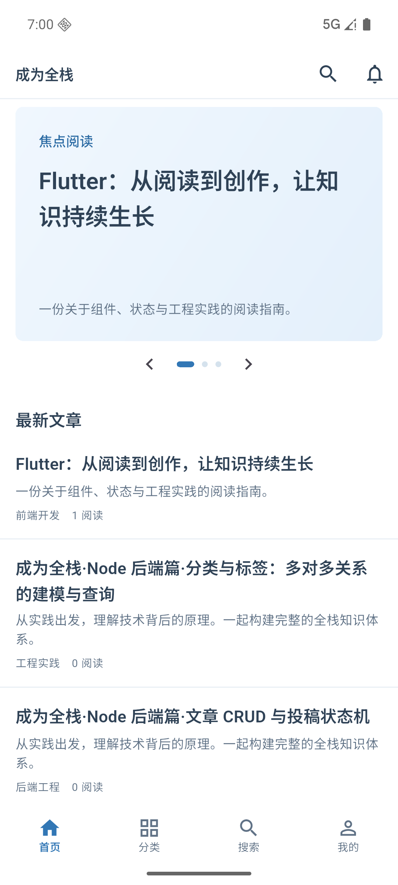
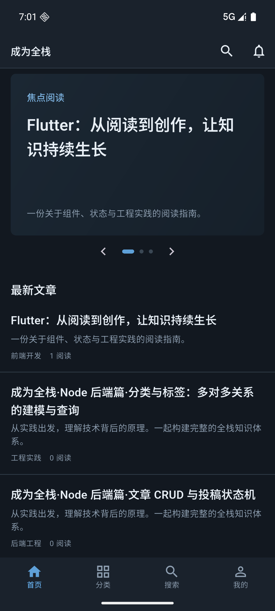

# Flutter APP 开发交付与本机验收

日期：2026-10-02。工程：`flutter-app/`。本记录描述实际实现与本机验收，不替代生产发布验收。

## 交付范围

| 模块 | 已实现 |
|---|---|
| 工程基础 | Flutter 3.47.1 / Dart 3.13.1、锁定依赖、Riverpod 注入、go_router 四 Tab、Dio、OpenAPI 模型生成器、CI |
| 阅读与发现 | 首页焦点/最新/热门、无限分页与刷新、分类树、标签、搜索与本机搜索历史、作者页、文章详情、上下篇、分享 |
| Markdown | GFM、代码横滚与复制、图片、表格横滚、外链、服务端目录锚点绑定与定位 |
| 会员 | 注册登录、登录后回跳、资料与头像、修改密码、通知及未读数、收藏、点赞记录、阅读历史、退出 |
| 投稿 | 我的稿件及筛选、新建/编辑、草稿保存、提交审核、发布后修改重新审核、私有预览、删除、封面和正文图片上传 |
| 编辑恢复 | 账号与稿件隔离的本机恢复副本、离开保护、上传进度与重试、失败保留输入、服务端更新时间冲突检查 |
| 评论 | 发言、回复对象与上下文、叠楼、跨页重组、限制视觉缩进、展开更多、删除自己的评论 |
| 主题与平台 | 浅色/深色/跟随系统并持久化、中文系统控件、320–430dp 大字体布局检查、Android 与 iOS 工程、开发期自定义 scheme 深链 |

现有网站、管理后台、后端源代码和冻结 OpenAPI 未修改。联调使用现有后端程序、独立 11002 端口与 `flutter-app/.local/backend.db`；启动脚本也将上传目录隔离到 `.local/uploads`。测试文章来自仓库内容的本地副本，真实 HTTP 读写，不是 APP 内假数据。

## 已执行的验收

| 命令/检查 | 结果与覆盖范围 |
|---|---|
| `flutter analyze` | 通过，No issues found |
| `flutter test` | 11 项通过：并发 401 单飞刷新、退出丢弃迟到响应、刷新重放失效、429 读写区分、评论跨页/循环防护、目录重复标题/代码/Setext、异步目录挂载、320/375/430dp 下 1.3 字体、首页/搜索/主题/登录校验 |
| `flutter test integration_test/app_test.dart -d emulator-5554` | 2 项通过：真实接口登录、创建草稿、预览、提交审核、目录跳转、收藏、发表评论、切换深色；原生 XFile 图片上传后下载验证与非法文件拒绝 |
| `node tool/verify_backend.mjs` | 通过：刷新旋转与重放、投稿状态转换、私有预览边界、服务端目录、评论分页、收藏增删、阅读进度；重启隔离后端脚本后再次通过 |
| `flutter build apk --debug` | Android debug 构建；产物 `flutter-app/build/app/outputs/flutter-apk/app-debug.apk` |
| Pixel 8 / Android 模拟器 | 安装并从正常 `lib/main.dart` 入口启动；测试入口不会作为最终运行入口 |

测试代码位于 `flutter-app/test/`、`flutter-app/integration_test/` 和 `flutter-app/tool/verify_backend.mjs`。本机原始日志位于被 Git 忽略的 `.local/`，可用上述命令复现；自动化 workflow 已提供，未声称远端 CI 已执行。

## 关键实现判断

1. 目录必须以服务端为准。客户端核对 ATX 标题层级和文本，绑定服务端 anchor；代码围栏和 Setext 不消费服务端目录项。目录异步返回时必须触发重新解析，否则正文能显示但目录无法跳转。无法配对的条目禁止错误跳转；目录接口失败不阻断阅读。
2. 写操作不能透明重试。429 只对短等待的读取重试一次；投稿创建取得 ID 后立刻复用该 ID，后续失败不重复创建。pending 稿件编辑维持 pending，published 修改由后端转 pending。
3. 鉴权需要防止跨账号迟到响应。access token 只存内存、refresh token 安全存储；刷新单飞、持久化串行、会话代次校验与私有页面重建共同隔离账号。
4. 实际接口返回结构经 repository 适配。例如点赞记录为裸数组、搜索列表位于 articles、历史条目包裹 article，不把它们误当统一列表信封。
5. 浅色/深色来自既有设计令牌；06/07 的细节差异按用户自主开发授权裁决，记录于 08。中文系统控件影响自动化返回按钮匹配，最终测试改用控件类型而非英文文案。
6. 默认本机分享只包含标题/摘要；配置真实 `SITE_URL` 后才添加网站链接，避免向外分享模拟器或 localhost 地址。

## 本机继续使用

从 `flutter-app` 目录运行：

```bash
./tool/start_backend.sh
# 另一个终端
node tool/prepare_backend.mjs
flutter emulators --launch pixel8
./tool/run_android.sh
```

已有后端/模拟器运行时不重复启动。测试会员：`flutter_reader`，密码：`Reader123456`。这些凭据仅供独立本机环境。完整配置、项目结构及构建方式见 `flutter-app/README.md`。

## 明确的验收边界

- 当前 Mac 只有 Command Line Tools，没有完整 Xcode；iOS 工程已提供，但没有宣称 iOS 构建或真机测试通过。安装完整 Xcode 后仍需执行 iOS 平台验收。
- 本次完成本机 Android 功能开发与联调；生产 API/网站域名、证书关联、商店签名和商店发布没有执行。release 必须显式配置 HTTPS API；当前模板 release 使用 debug 签名，发布前必须替换。
- 通知列表、未读数、标记已读已接入；现有后端通知产生机制的覆盖不由 APP 补造。服务端当前没有的第三方登录等能力不扩展为模拟功能。
- 自动化图片上传验证了真实原生文件和 HTTP 链路；系统相册/相机权限、设备厂商差异、弱网长时使用与辅助技术仍需发布前真机验收。本地测试不能替代这些证据。

## 最终运行截图

以下截图来自 Android 模拟器中正常入口安装包，非 HTML 原型；最终进程前台为 `com.yingzhou.fullstack_reader/.MainActivity`。

| 浅色首页 | 深色首页 |
|---|---|
|  |  |
